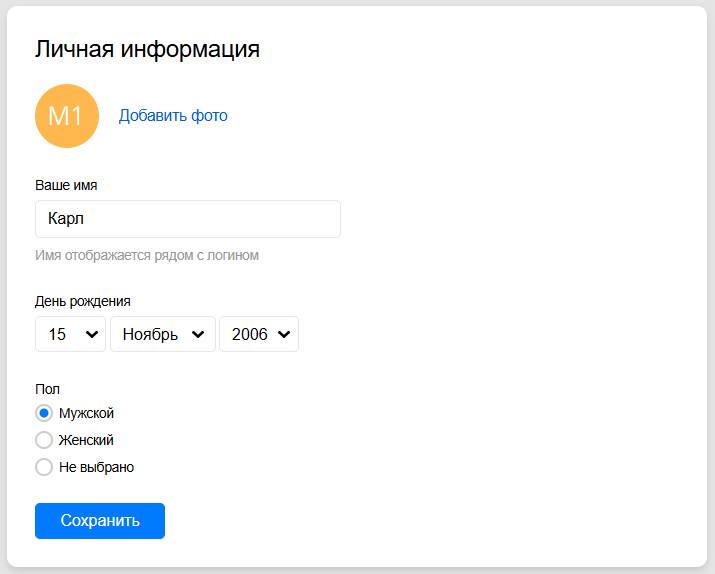

Сделай так личный кабинет студента выглядел как на картинке, но сделай так чтобы было 3 кнопки: 
1. Мои данные (редактирование профиля)
2. Избранные вакансии
3. Мои отклики

А также сделай так чтобы при нажатии на кнопку "Мои отклики" открывалась страница с откликами студента, а при нажатии на кнопку "Избранные вакансии" открывалась страница с избранными вакансиями студента, а при нажатии на кнопку "Мои данные" открывалась страница с данными студента    

Еще добавь когда ты регаешься как работодатель то у тебя тоже был личный кабинет только с другими кнопками: 
1. Мои данные (редактирование профиля)
2. Мои вакансии
3. Мои отклики
Когда ты входишь как работодатель то у тебя открывается личный кабинет работодателя, а когда ты входишь как студент то у тебя открывается личный кабинет студента
Еще сделай возможность добавить вакансию, а также редактировать и удалять ее (когда ты входишь как работодатель)